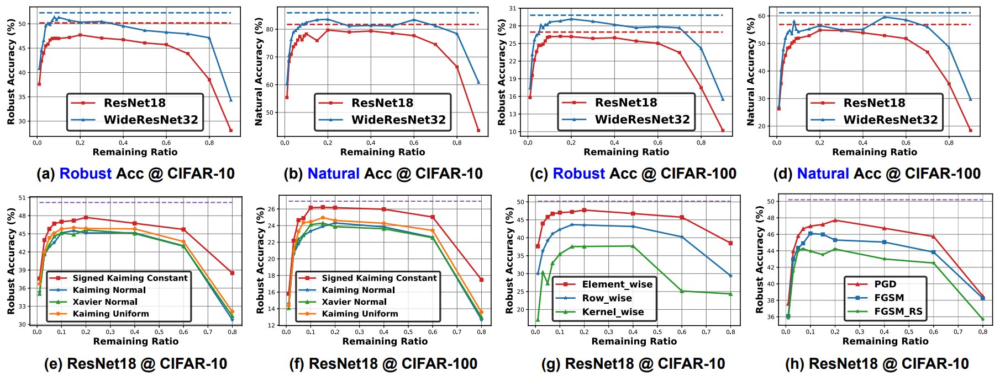
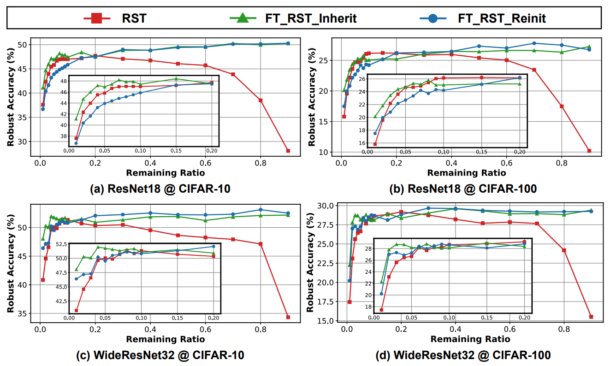
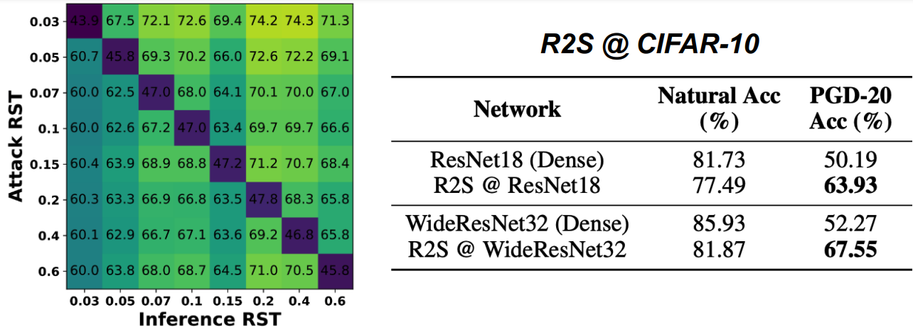

# Drawing Robust Scratch Tickets: Subnetworks with Inborn Robustness Are Found within Randomly Initialized Networks
***Yonggan Fu***, Qixuan Yu, Yang Zhang, Shang Wu, Xu Ouyang, David Cox, Yingyan Lin

Accepted at NeurIPS 2021 [[Paper Link]](https://proceedings.neurips.cc/paper/2021/hash/6ce8d8f3b038f737cefcdafcf3752452-Abstract.html).


## Overview
- Deep Neural Networks (DNNs) are known to be vulnerable to adversarial attacks. To tackle this, adversarial training is currently the most effective defense method, by augmenting the training set with adversarial samples generated on the fly. Interestingly, we discover for the first time that *there exist subnetworks with inborn robustness, matching or surpassing the robust accuracy of the adversarially trained networks with comparable model sizes, within randomly initialized networks without any model training*, indicating that adversarial training on model weights is not indispensable towards adversarial robustness. We name such subnetworks ***Robust Scratch Tickets (RSTs)***, which are also by nature efficient.

## Robust Scratch Ticket: The Existence
- We find that there exist subnetworks with inborn robustness, matching or surpassing the robust accuracy of adversarially trained networks with comparable model
sizes, within randomly initialized networks without any model training, dubbed as Robust Scratch Tickets (RSTs).

<p align="center">
  
</p>

## Robust Scratch Ticket: The Property
- The existence of RSTs under low weight remaining ratios reveals another ***lottery ticket phenomenon*** in that *(1)* an RST without any model training can
achieve a better or comparable robust and natural accuracy with an adversarially trained subnetwork of the same structure, and *(2)* the fine-tuned RSTs with inherited weights can achieve a notably better robust accuracy than the re-initialized ones, indicating that RSTs win a better initialization.

<p align="center">
  
</p>

## Robust Scratch Ticket: The Application
- We identify the poor adversarial transferability between RSTs of different weight remaining ratios drawn from the same randomly initialized networks. Thus we propose the R2S technique to randomly switch between different RSTs from a candidate RST set during inference, leading to a mismatch between the RSTs adopted by the adversaries to generate attacks and the RSTs used for inference.

<p align="center">
  
</p>


## Code Usage

Our codes support the adversarial search of RSTs and finetune RSTs with inherited/re-initialized model weights.
Basic settings are listed in `.yml` files as shown in the dir `config_rst` which is specified by the arg `--config`. Most settings in `.yml` files can be overrided by specifying other args, e.g., `--data path-to-dataset`.

### Prerequisites

See `env.yml` for the complete conda environment. Create a new conda environment:
```
conda env create -f env.yml
conda activate pytorch
```

### Search/Finetune RSTs on CIFAR-10/100

- To search an RST from a randomly initialized PreActResNet18 on CIFAR-10:
```
python main.py --config config_rst/resnet18-usc-unsigned-cifar.yaml --multigpu 0 --set CIFAR10 --data path-to-data --lr_policy cifar_piecewise --epochs 160  --prune-rate target-prune-rate --name exp_name --attack_type pgd --task search
```
Note that `--prune-rate` is the ratio of remaining weights as reported in the paper.

- To finetune the searched RST from PreActResNet18 on CIFAR-10 with inherited model weights:
```
python main.py --config config_rst/resnet18-usc-unsigned-cifar.yaml --multigpu 0 --set CIFAR10 --data path-to-data --lr_policy cifar_piecewise --epochs 160  --prune-rate target-prune-rate --name exp_name --attack_type pgd --task ft_inherit --pretrained path-to-searched-rst
```
The arg `--pretrained` specifies the checkpoint of the searched RST, which is not necessary if the finetuning and search process are in the same working directory.

- To finetune the searched RST from PreActResNet18 on CIFAR-10 with re-initialized model weights:
```
python main.py --config config_rst/resnet18-usc-unsigned-cifar.yaml --multigpu 0 --set CIFAR10 --data path-to-data --lr_policy cifar_piecewise --epochs 160  --prune-rate target-prune-rate --name exp_name --attack_type pgd --task ft_reinit --pretrained path-to-searched-rst
```


### Search RSTs on ImageNet

- To search an RST from a randomly initialized ResNet-50 on ImageNet:

```
python main.py --config config_rst/resnet50-ukn-unsigned-imagenet.yaml --set ImageNet --data path-to-data --lr_policy multistep_lr_imagenet --epochs 90  --prune-rate target-prune-rate --name exp_name --attack_type pgd --alpha 2 --epsilon 4 --attack_iters 2 --val_every 5 --task search --automatic_resume
```

### Search Robust Trained Tickets (RTTs)

- To search natural/adv RTTs from trained networks, the first step is to acquire a naturally/adversarially trained network. For example, to get an adversarially trained PreActResNet18 on CIFAR-10:

```
python train_full.py --config config_rst/resnet18-usc-unsigned-cifar.yaml --multigpu 0 --set CIFAR10 --data path-to-data --epochs 160 --lr 0.1 --lr_policy cifar_piecewise --name exp_name --attack_type pgd
```
If `--attack_type pgd` is deleted, the training process will be on clean images. After acquiring the pretrained models, RTTs can be drawn via specifying `--pretrained` during the adversarial search process.


### Test adversarial transferability between RSTs

- To test the adversarial transferability between different RSTs, all the checkpoints containing the searched RSTs should be in the same dir with similar names, e.g., `ckpt/{network}_{prune-rate}.pth`. For example, to test the robust accuracy of the RST from PreActResNet18 with 1% weight remaining under the adversarial attacks generated by other RSTs:

```
python test_trans.py --config config_rst/resnet18-usc-unsigned-cifar.yaml --set CIFAR10 --data path-to-data --name exp_name --attack_type pgd --pretrained ckpt/resnet18_0.01.pth
```


## Citation
```
@article{fu2021drawing,
  title={Drawing Robust Scratch Tickets: Subnetworks with Inborn Robustness Are Found within Randomly Initialized Networks},
  author={Fu, Yonggan and Yu, Qixuan and Zhang, Yang and Wu, Shang and Ouyang, Xu and Cox, David and Lin, Yingyan},
  journal={Advances in Neural Information Processing Systems},
  volume={34},
  year={2021}
}
```

## Acknowledgement

Our codes are modified from [[What’s Hidden in a Randomly Weighted Neural Network]](https://github.com/allenai/hidden-networks).


